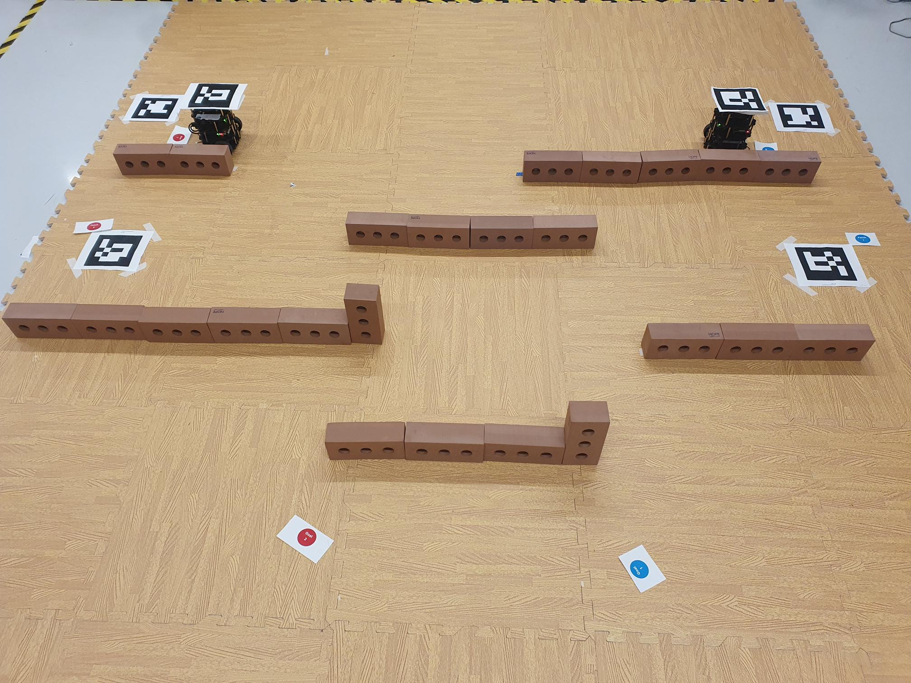

# COMP0182 (Multi-Agent Systems): Final Robotic Challenge

## Heads-Up for the Final Robotic Challenge

Date: Friday, December 06, 2024

Trial Arena Closing Time: 12:30 hrs for preparation

Robotic Challenge Start Time: 13:00 hrs

## Task Steps

### Initial Requirements:

  - Each group starts with **basic adjustments** upon arriving at the arena.
  - Complete the **Single Agent Task** first: A TurtleBot starts from the starting position, touches the Fetch Point (FP) marked by ArUco markers, and travels to the goal position.
  - Then proceed to the **Multi-Agent Task**, where both TurtleBots navigate to their respective FPs and goal positions.

---

### Group Workflow:

  - When a group completes their **real-world application tasks**, the next group will take over the arena.
  - During this time, the **simulation tasks** of the previous group will be checked by the Teaching Assistants.
  - Each group must complete a total of **4 tasks**:
  	- **2 Simulation Tasks**
  	- **2 Real-World Application Tasks**

---

### Penalties:

  - **Collisions**: Each collision with obstacles or agents adds **10 seconds** to your total time.
  - **Manual Corrections**: Each manual adjustment adds **20 seconds** to your total time.

---

### Attempts:

  - Each group has **two attempts** to complete the tasks.
  - If both are successful, the best performance will count as the final result.

---

### Mission Timing:

  - The mission begins when the TurtleBots start their trajectories.
  - It ends when both TurtleBots stop at their goal positions.

---

Example Map and Solution:

---

Good luck with the challenge! 🚀
