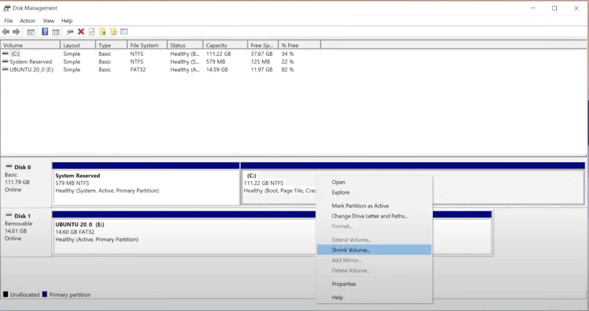
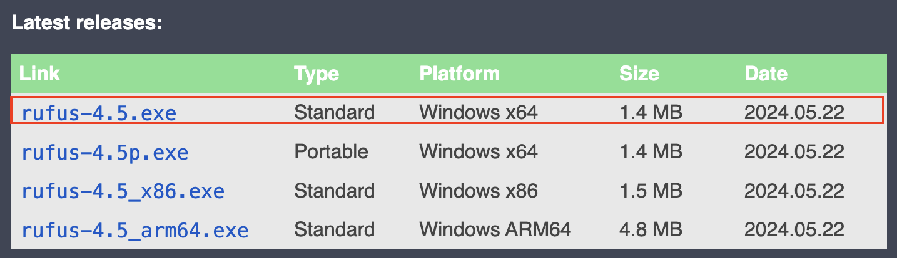

# COMP0182 (Multi-Agent Systems): Lab Sheet 1

----------------------------------------------------------------------------------------------------------------------------------------------------------------------------------------------------------------------------

## Task 1: Installation of Ubuntu 20.04

For this course, everyone **must** use **Ubuntu 20.04**. The best way to set up an Ubuntu 20.04 on your computer. We strongly suggest a **Dual Boot rather than a Virtual Machine or Docker**. 

## Options for different computers (Windows/macOS):

- **Option 1**: [Install Ubuntu 20.04 Dual Boot with Windows 11 (**_Highly Recommended_**)](#option-1-install-ubuntu-2004-dual-boot-with-windows-11-highly-recommended)

- **Option 2**: [Install Virtual Machine on macOS (**_Highly Recommended_**)](#option-2-install-virtual-machine-on-macos-highly-recommended) 

- **Option 3**: [Install RoboStack on Windows 11 or macOS with Virtual Machine (**_Optional_**)](#option-3-install-robostack-on-windows-11-or-macos-with-virtual-machine-optional)

### Option 1: Install Ubuntu 20.04 Dual Boot with Windows 11 (**_Highly Recommended_**)

Adapted from:
https://www.youtube.com/watch?v=-iSAyiicyQY&t=562s&ab_channel=KskRoyal

**1. Pre-requisites**:
- A Windows 11 or higher computer
- At least 25 GB of free disk space for Ubuntu 20.04
- A USB drive with at least 8GB
- Internet connection

**2. Disable Secure Boot**:

For some computers, `Secure Boot` will still prevent you from installing or booting new operating systems. To disable this:
    - Turn your computer OFF. Then, turn it back ON and press the BIOS entry key during the boot process. This varies between hardware types, but is generally F1, F2, F12 …
    - Find the **Secure Boot** option. If possible, set it to **Disabled**. It is usually found in the Security tab, Boot tab, or Authentication tab.
    - **Save and Exit**. Your system will reboot.

Reference:
    [How to Disable UEFI Secure Boot to Dual Boot Any System](https://www.makeuseof.com/tag/disable-secure-uefi-dual-boot/)

**3. Create a new partition on your Windows computer for Ubuntu**:
- Click ***Win + R*** and type ***cmd*** to open the terminal
- Type `diskmgmt.msc` and enter to open the Disk management
- Right click the last available partition and select ***Shrink volume***, shrink at least 25 GB
- An unallocated partition will come up once it is shrunk successfully



**4. Download Ubuntu 20.04 Image**:
Download ***Ubuntu 20.04*** from the official website, select ***64-bit PC (AMD64) desktop image***

[Ubuntu 20.04.6 LTS (Focal Fossa)](https://releases.ubuntu.com/focal/)

**5. Download Rufus Software**:
***Rufus*** software is to make your USB drive bootable, select the ***Standard*** type with your computer platform.

[Rufus - Create bootable USB drives the easy way](https://rufus.ie/en/)



For most of you, choose the standard one with the platform Windows x64.

**6. Format the USB drive and make it bootable**:
- Insert your USB into the USB port
- In the File Explorer, right-click your USB and select ***Format*** option, and follow the instructions
- Right click the ***Rufus*** and run as an administrator
- Leave everything default, click ***SELECT*** option and select the ISO image file just downloaded (ubuntu-20.04.6-desktop-amd64.iso).
- Click ***START*** and follow the steps


**7. Install Ubuntu 20.04 Dual Boot**:
- Restart the computer. Press F11 (the button might be different for different computer brands, search for how to enter the ***Boot Menu*** for yours)
- Choose the USB drive as the boot device.

**8. Finish the Ubuntu installation setup**:

Follow the instructions to go ahead. 
- In ***Update and other software*** tab, it is recommended to select ***Normal installation*** and tick both of the two ***Other options***
- In ***Installation type*** tab, it is recommended to select ***Something else*** and continue
- In the next tab, you should see the disk info of your Windows system and the free space just created. Then select the free space and click on the ‘**+**’ button. Create a root partition (’**/**’) and allocate (recommended) 25 GB space for it, make sure you tick the same option as shown in the following figure


- Use the remaining free space to create a ***swap*** partition. It is recommended to allocate at least 4 GB for it.


- Lastly, still in the installation type tab, change the device for boot loader installation to the same device as your root partition. After all, click ***Install Now*** and follow the instructions on your screen


After restarting your computer, the Ubuntu dual boot menu will be shown.

Reference:
https://www.freecodecamp.org/news/how-to-dual-boot-windows-10-and-ubuntu-linux-dual-booting-tutorial/

### Option 2: Install Virtual Machine on macOS (**_Highly Recommended_**)

As mentioned in Lab Session 1, accessing an Nvidia GPU from within a virtual machine is often complex. However, since MacBooks do not use Nvidia GPUs, there is generally no significant difference between using a virtual machine or a dual boot setup on a MacBook in terms of GPU access (but you can still choose to use dual boot on a Macbook for better performance and resolution). Additionally, installing a virtual machine is usually more user-friendly than setting up a dual boot environment.

**1. Download a virtual machine platform**:
There are several options for virtual machine platforms on the internet (Parallels Desktop, UTM…), you can do some research and select on your own. In this tutorial, we use VMware Fusion Pro for demonstration.
Go to the website:
https://blogs.vmware.com/teamfusion/2024/05/fusion-pro-now-available-free-for-personal-use.html
Scroll down and click “VMware Fusion Pro Download”


You might be asked to create an account, then just do it and follow the instructions.

**2. Download Ubuntu 20.04 image**:
Similar to dual boot, you need to download an image file from the official website to install the operating system. 
[64-bit ARM (ARMv8/AArch64) server install image](https://cdimage.ubuntu.com/releases/20.04/release/ubuntu-20.04.5-live-server-arm64.iso)
Normally, we prefer to download the desktop image which can give us the GUI desktop directly after installation. Unfortunately, the desktop image for ARM64 is no more released currently. But we can still install the server image first, and install the GUI desktop manually.

**3. Open the virtual machine platform, in this case, VMware gives**:


Simply drag the .iso file you just download here. Follow the instructions, there is no setting you need to change (you can if you want).


**4. Finish the installation setup**:
There are not too many things to change from default in this step, if you want a quicker setup, just skip everything and select `Continue` or `Done` at each step.


**Suggested optimisation on partition:**

- **Reduce `/boot` Size:** You can safely reduce `/boot` to 500 MB - 1 GB.
- **Reduce EFI Partition Size:** Consider reducing `/boot/efi` to around 300 MB to free up some space.
- **Increase the Root (`/`) Size:** If you plan to use this virtual machine for more than basic tasks, use all the rest space to increase the root partition.


**5. Finish the setup**:
After a few minutes, you will see `install complete` in the top left corner, and the system will turn to an update stage. Normally, this update stage will take quite a long time. You can skip it by selecting `Cancel update and reboot`. 


**6. Install GUI**:
After reboot, you will be led to the Ubuntu Server terminal, as we need to use simulation for further work, a GUI desktop is necessary. First, type the username and password you just set to log in and you will be free to use it.


To install the GUI, run the following command in the terminal.

```bash
sudo apt update
sudo apt install ubuntu-desktop
```

After installing and rebooting, the Ubuntu desktop in the virtual machine has been successfully installed and is ready to use.

```bash
sudo reboot
```


**7. (Optional) Make sure your virtual machine platform selects the disk for startup**:
If the platform is still using the image(CD) file to start the virtual machine, you will be led to install the operation system every time you reboot it. To avoid this:
- Go to the settings menu of the virtual machine, and check the boot order in the startup tab.


- Select the `Hard Disk` to start up the virtual machine.
- Run `sudo reboot` in the terminal to see if it works.

### Option 3: Install RoboStack on Windows 11 OR macOS with Virtual Machine (**_Optional_**)

For some of you studying COMP0242 and COMP0245 courses, you should already have RoboStack installed on your computer. This is an alternative platform to Option 1 and Option 2 in the above. We strongly recommend you use Ubuntu 20.04 Dual Boot (Option 1) since it is more stable for ROS and PyBullet. But you can still try RoboStack since it is convenient, light, and easy to install. For some parts of the script or software used in this module, there might be problems with RoboStack. If you encounter some problems on happen on RoboStack and manage to fix them, please share it on Moodle so that more people can use it.

**1. Install miniforge and RoboStack on Windows 11**:

To get started with conda (or mamba) as a package manager, you need to have a base conda installation. Please do *not* use the Anaconda installer, but rather start with [`miniforge`](https://github.com/conda-forge/miniforge) which is a much more "minimal" installer. This installer will create a "base" environment that contains the package managers conda and mamba. After this installation is done, you can move on to the next steps.

Download the installer from: https://conda-forge.org/download/

run `conda` or `mamba` to see if it is installed successfully.

Next, follow the installation steps on this website "https://robostack.github.io/GettingStarted.html" for installing RoboStack on your machine.

**2. Install miniforge and RoboStack on macOS**:

To get started with conda (or mamba) as a package manager, you need to have a base conda installation. Please do *not* use the Anaconda installer, but rather start with [`miniforge`](https://github.com/conda-forge/miniforge) which is a much more "minimal" installer. This installer will create a "base" environment that contains the package managers conda and mamba. After this installation is done, you can move on to the next steps.

Download the installer using curl or wget or your favorite program and run the script.

```bash
curl -L -O "https://github.com/conda-forge/miniforge/releases/latest/download/Miniforge3-$(uname)-$(uname -m).sh"
bash Miniforge3-$(uname)-$(uname -m).sh
```

run `conda` or `mamba` to see if it is installed successfully.

Next, follow the installation steps on this website "https://robostack.github.io/GettingStarted.html" for installing RoboStack on your machine.

----------------------------------------------------------------------------------------------------------------------------------------------------------------------------------------------------------------------------

## Task 2: Installation of ROS Noetic

For this course, everyone **must** use ROS Noetic. 

Adapted from:
https://wiki.ros.org/noetic/Installation/Ubuntu

Open the ***Terminal*** by clicking it in the application menu or shortcut **Ctrl + Alt + T**, then paste the following commands:

**1. Set up your source.list**

```bash
sudo sh -c 'echo "deb http://packages.ros.org/ros/ubuntu $(lsb_release -sc) main" > /etc/apt/sources.list.d/ros-latest.list'
```

It will ask for your password, but it will **not** be shown on your screen, just type it and enter. As long as there is nothing shown (such as an error message), it means the command has been run correctly


**2. Set up your keys**

```bash
sudo apt install curl # if you haven't already installed curl
curl -s https://raw.githubusercontent.com/ros/rosdistro/master/ros.asc | sudo apt-key add -
```

**3. Installation**

```bash
sudo apt update
```

It is recommended to install the Desktop-Full version:

```bash
sudo apt install ros-noetic-desktop-full
```

Once it's done, the ROS Noetic has been successfully installed

**4. Environment setup**

Every time you want to use ROS from the terminal, you have to source this first:

```bash
source /opt/ros/noetic/setup.bash
```

This is necessary for **every** new terminal tab you open.

It will be convenient to automatically source the script by adding it to `~/.bashrc` :

```bash
echo "source /opt/ros/noetic/setup.bash" >> ~/.bashrc
source ~/.bashrc
```

**5. Installing essential dependencies**

```jsx
sudo apt install python3-rosdep python3-rosinstall python3-rosinstall-generator python3-wstool build-essential
```

**6. After all, enter `roscore` to see if the ROS runs successfully**

**Reference**:
https://medium.com/@createwithabd/ros-noetic-installation-guide-on-ubuntu-20-04-388568d24bcf

----------------------------------------------------------------------------------------------------------------------------------------------------------------------------------------------------------------------------

## Task 3: Install VS Code and Git

**1. Install VS Code**:
- You can directly download the package to install Visual Studio Code from the official website: https://code.visualstudio.com/download
Make sure you select the correct format of it. For Ubuntu OS, we need `.deb` file, and then select `x64` or `Arm64` based on your machine’s architecture.


- Then in the terminal, use `cd` command to go to the folder where you download the package, and use the following command to install it.

```bash
    sudo dpkg -i [package]
```


**2. Install Git**:
Normally, Git should have been installed on your Ubuntu system, run `git` to see if it is installed. If not, use the following command to install it.

```bash
sudo apt install git-all
```

----------------------------------------------------------------------------------------------------------------------------------------------------------------------------------------------------------------------------

## Problem encountered or optional step

If you encountered problems during installation, please refer below:

**1. BitLocker**:
BitLocker is a disk encryption utility built into some Windows machines that may be triggered during system partitioning or operations. If this happens you need to enter the BitLocker recovery key to re-enter Windows. We suggest you simply turn it off before partitioning the disks.
- Search ***Manage BitLocker*** from the search bar of Windows and open it. If you cannot find it, go to ***Settings → Control Panel → System and Security → BitLocker Drive Encryption***
- Select ***Turn off BitLocker***

(Optional) Enter the Recover key to unlock it
In case you do not want to turn BitLocker off or the problem has been encountered, follow the instructions to find your recovery key. For example, log in to the same Microsoft account as your computer’s on the page https://account.microsoft.com/devices/recoverykey. In the ***Device*** tab, you will find your recovered key.


**2. Default Boot**:
After the dual boot is installed, the GRUB (GRand Unified Bootloader) will ask you the system you would like to boot and the default boot system will be Ubuntu. If you want to change the default selection to Windows, use the following instructions to modify the configuration file of GRUB:


- Open the terminal in Ubuntu
- run the following command

```bash
sudo nano /etc/default/grub
```

- Find this line

```bash
GRUB_DEFAULT=0
```

- Change it to the entry of Windows. For example, if Windows is the second (0, 1, 2) option in the GRUB menu, change it to:

```bash
GRUB_DEFAULT=2
```

- Save the file and exit the nano editor (press `Ctrl + O` to save, then `Ctrl + X` to exit).
- Run the following command to update the GRUB configuration:

```bash
sudo update-grub
```

- Then reboot the computer

```bash
sudo reboot
```

**3. Low packages downloading speed**:
If you have two disks on your laptop, it is recommended to use the one with the higher read/write speed for installing Ubuntu. If you don't know which one is better, just use the one with Windows installed if the space is enough. Using a slower disk may lead to decreased performance when installing software and packages in Ubuntu.

**4. ROS quick setup (Source https://github.com/fishros/fish_install)**:
We suggest you use the official instructions in [Task2](https://www.notion.so/COMP0182-Real-world-Multi-agent-Systems-8876543ee87747a3aa30972c9f4631d9?pvs=21) to install ROS, but if you find it difficult to understand, this tool can be used for a quick setup of ROS
- Open terminal in Ubuntu
- Run the following command and follow the instructions

```bash
wget https://raw.githubusercontent.com/fishros/fish_install/main/install -O - | bash
```

**5.  Optimize your hard drive for more partition space**:
In case you want more space in your laptop, check this tutorial for more information:
[How to Dual Boot Windows 10 and Ubuntu – Linux Dual Booting Tutorial](https://www.freecodecamp.org/news/how-to-dual-boot-windows-10-and-ubuntu-linux-dual-booting-tutorial/)

