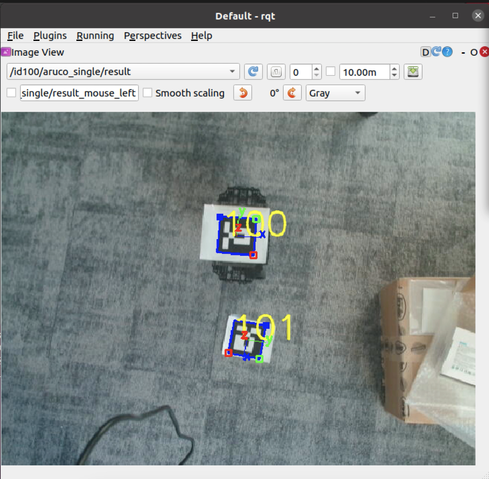

# COMP0182 (Multi-Agent Systems): Lab Sheet 5

----------------------------------------------------------------------------------------------------------------------------------------------------------------------------------------------------------------------------

## Task 1: Mapping

In the previous lab session, you might have created a complete map of the test environment area in the IoT Lab arena and saved the map data to the local drive for this week's Navigation use. 

The "map.pgm" or "map.yaml" will be saved in the home folder ~/(/home/${username}) of your laptop/Remote PC.

The map uses a two-dimensional Occupancy Grid Map (OGM), which is commonly used in ROS. The saved map will look like the figure below, where the white area is a collision-free area while black area is an occupied and inaccessible area, and the gray area represents the unknown area. 


The Navigation uses a map created by the SLAM. If you have already saved the map file in our previous lab session, please proceed to **Task 2: Navigation**. If not done in the previous lab session, please prepare a map before running the Navigation.

### Run SLAM code

1. Open the first terminal on the **Remote PC**, and run the ROS master:
   
```bash
roscore
```

Please keep this terminal open.

2. Open the second terminal on the **Remote PC**, SSH to your TurtleBot3 with "**ubuntu**" as username and "**turtlebot**" as password. Run the Bringup on **TurtleBot3 terminal**

```bash
ssh ubuntu@{IP_ADDRESS_OF_TURTLEBOT3}
export TURTLEBOT3_MODEL=burger
roslaunch turtlebot3_bringup turtlebot3_robot.launch
```

3. On **Remote PC**, open the third terminal and run the SLAM node:
   
```bash
export TURTLEBOT3_MODEL=burger
roslaunch turtlebot3_slam turtlebot3_slam.launch
```

This will take you to RViz, where the map, LiDAR, robot, etc are visualized.

### Run Teleoperation

4. On **Remote PC**, open the fourth terminal and run the teleoperation node, control your TurtleBot3, explore the lab arena, and see the process of mapping:

```bash
export TURTLEBOT3_MODEL=burger
roslaunch turtlebot3_teleop turtlebot3_teleop_key.launch
```

Press a, w, x, and d to move TurtleBot3 around the lab. At the end, press s to stop the TurtleBot3.

### Save Map

5. On **Remote PC**, open the fifth terminal and save the map. In order to let the TurtleBot3 auto-navigation in the scene, you need to have a global map. The map data was collected while it was traveling in the last step:

```bash
rosrun map_server map_saver -f ~/map
```

The -f option specifies a folder location and a file name where files are to be saved. With the above command, map.pgm and map.yaml will be saved in the home folder ~/(/home/${username}).

## Task 2: Navigation

Navigation is to move the robot from one location to the specified destination in a given environment. For this purpose, a map that contains geometry information of furniture, objects, and walls of the given environment is required. As described in the previous SLAM section, the map was created with the distance information obtained by the sensor and the pose information of the robot itself.

Navigation enables a robot to move from the current pose to the designated goal pose on the map by using the map, the robot’s encoder, the IMU sensor, and the distance sensor. The procedure for performing this task is as follows.

**1. Run Navigation Node**

1. If roscore is not running on the **Remote PC**, run roscore in the first terminal. Skip this step if roscore is already running.

```bash
roscore
```

Please keep this terminal open.

2. If the Bringup is not running on the TurtleBot3, launch the Bringup. Skip this step if you have launched bring-up previously.

Open the second terminal on the **Remote PC**, SSH to your TurtleBot3 with "**ubuntu**" as username and "**turtlebot**" as password. Run the Bringup on **TurtleBot3 terminal**:

Please use the proper keyword among burger, waffle, waffle_pi for the TURTLEBOT3_MODEL parameter.

```bash
$ ssh ubuntu@{IP_ADDRESS_OF_TURTLEBOT3}
$ export TURTLEBOT3_MODEL=${TB3_MODEL}
$ roslaunch turtlebot3_bringup turtlebot3_robot.launch
```

3. On **Remote PC**, open the third terminal and launch the Navigation:

Please use the proper keyword among burger, waffle, waffle_pi for the TURTLEBOT3_MODEL parameter.

```bash
$ export TURTLEBOT3_MODEL=burger
$ roslaunch turtlebot3_navigation turtlebot3_navigation.launch map_file:=$HOME/map.yaml
```

**Tip:**

To avoid manually setting it every time, you can add this command to ~/.bashrc and source ~/.bashrc.

The .bashrc file is automatically loaded when a terminal window is created.

Example of defining TurtlBot3 Burger as a default model:

```bash
$ echo 'export TURTLEBOT3_MODEL=burger' >> ~/.bashrc
$ source ~/.bashrc
```

**2. Estimate Initial Pose**

Initial **Pose Estimation** must be performed before running the **Navigation** as this process initializes the AMCL parameters that are critical in Navigation. TurtleBot3 has to be correctly located on the map with the LDS sensor data that neatly overlaps the displayed map.

1. Click the **2D Pose Estimate** button in the RViz menu.

2. Click on the map where the actual robot is located and **drag the large green arrow toward the direction where the robot is facing**.

3. Repeat steps 1 and 2 **until the LDS sensor data is overlayed on the saved map**.
   
4. Launch the keyboard teleoperation node **to precisely locate the robot on the map**. Skip this step if teleoperation node is already running.
   
```bash
$ roslaunch turtlebot3_teleop turtlebot3_teleop_key.launch
```

5. Move the robot back and forth a bit to collect the surrounding environment information and narrow down the estimated location of the TurtleBot3 on the map which is **displayed with tiny green arrows**.
 
6. Terminate the keyboard teleoperation node by entering Ctrl + C to the teleoperation node terminal **in order to prevent different cmd_vel values are published from multiple nodes** during Navigation.


**3. Set Navigation Goal**

1. Click the **2D Nav Goal** button in the RViz menu.

2. Click on the map to set the destination of the robot and **drag the green arrow toward the direction** where the robot will be facing.
   
This green arrow is a marker that can specify the destination of the robot.

The root of the arrow is the x, y coordinate of the destination, and the angle θ is determined by the orientation of the arrow.

As soon as x, y, θ are set, **TurtleBot3 will start moving to the destination immediately**.

**References:**

[1]. TurtleBot3 Navigation Example, https://www.youtube.com/watch?v=VYlMywwYALU/.

[2]. Navigation, https://wiki.ros.org/navigation/.


## Task 3: Single-Robot Auto Navigation

First, you connect the Logitech C920 HD Pro camera to **Remote PC**/laptop. 

In auto navigation, the camera detects the marker on top of the robot and the marker on the ground. The marker on the ground is the goal position and the application allows the robot to navigate from its original position to the goal position.

Firstly, the ID number of the ArUco markers being used needs to be remembered. In the example, the marker on the robot has ID 100 and the marker on the ground has ID 101. Different IDs can be used with modifications in the code to correctly detect and read marker positions.

1. If roscore is not running on the **Remote PC**, run roscore in the first terminal. Skip this step if roscore is already running.

```bash
roscore
```

Please keep this terminal open.

2. If the Bringup is not running on the TurtleBot3, launch the Bringup. Skip this step if you have launched bring-up previously.

Open the second terminal on the **Remote PC**, SSH to your TurtleBot3 with "**ubuntu**" as username and "**turtlebot**" as password. 

Run the Bringup on **TurtleBot3 terminal**:

```bash
ssh ubuntu@{IP_ADDRESS_OF_TURTLEBOT3}
export TURTLEBOT3_MODEL=burger
roslaunch turtlebot3_bringup turtlebot3_robot.launch
```

3. On **Remote PC**, open the third terminal and run multiple aruco marker finder:
   
```bash
export TURTLEBOT3_MODEL=burger
roslaunch auto_aruco_marker_finder multiple_aruco_marker_finder.launch
```

4. Still on **Remote PC**, open fourth terminal and run rqt to check if markers are correctly detected:

```bash
export TURTLEBOT3_MODEL=burger
rosrun rqt_gui rqt_gui
```

The rqt window shows a correct detection.



5. Still on **Remote PC**, open fifth terminal and run:

```bash
cd catkin_ws/src/COMP0182-Multi-Agent-Systems/turtlebot3_burger_auto_navigation/auto_navigation/scripts 
chmod +x goal_pose.py
export TURTLEBOT3_MODEL=burger
rosrun auto_navigation goal_pose.py
```

5. Still on **Remote PC**, open sixth terminal and run:

```bash
export TURTLEBOT3_MODEL=burger
rosrun auto_navigation goal_pose.py
```

Then the robot should be moving to the destination.

If the robot is not moving and error occurs on the terminal, please follow the below troubleshoot suggestions.

==============================================================================

## Troubleshoot / Suggestions

==============================================================================

1. Go to the folder and open the usb_cam_stream_publisher.launch file: catkin_ws/src/COMP0182-Multi-Agent-Systems/turtlebot3_burger_auto_navigation/auto_aruco_marker_finder/launch/usb_cam_stream_publisher.launch. Example of how your node might look after changing video and changing the auto focus control:

```bash
<!--
Example of run:
roslaunch usb_cam_stream_publisher.launch video_device:=/dev/video2 image_width:=640 image_height:=480
-->

<launch>
<arg name="video_device" default="/dev/video2" /> <!-- video2 for Logitech C920 HD Pro Camera  -->
<arg name="image_width" default="640" />
<arg name="image_height" default="480" />


<node name="usb_cam" pkg="usb_cam" type="usb_cam_node" output="screen" >
	<param name="video_device" value="$(arg video_device)" />
	<param name="image_width" value="$(arg image_width)" />
	<param name="image_height" value="$(arg image_height)"/>
	<param name="pixel_format" value="mjpeg" />
	<param name="camera_frame_id" value="usb_cam" />
	<param name="io_method" value="mmap"/>
        <param name="focus_auto" value="0" />  <!-- Disable autofocus -->
</node>
</launch>
```

2. Go to the folder and open the multiple_aruco_marker_finder.launch file: catkin_ws/src/COMP0182-Multi-Agent-Systems/turtlebot3_burger_auto_navigation/auto_aruco_marker_finder/launch/multiple_aruco_marker_finder.launch. Example of how your node might look after changing it:

```bash
<launch>

<arg name="video_device" default="/dev/video2 />  <!-- video2 for Logitech C920 HD Pro Camera  -->
<arg name="image_width" default="640" />
<arg name="image_height" default="480" />

<node name="usb_cam" pkg="usb_cam" type="usb_cam_node" output="screen" >
    <param name="video_device" value="$(arg video_device)" />
    <param name="image_width" value="$(arg image_width)" />
    <param name="image_height" value="$(arg image_height)"/>
    <param name="pixel_format" value="mjpeg" />
    <param name="camera_frame_id" value="usb_cam" />
    <param name="io_method" value="mmap"/>
    <param name="focus_auto" value="0" /> <!-- Disable autofocus -->
</node>

<!-- launch 2 auto_aruco_marker_finder with topic suffix id100 and id101  -->
<group ns="id100">
    <include file="$(find auto_aruco_marker_finder)/launch/aruco_marker_finder.launch">
    <arg name="markerId" value="100"/>
    </include>
</group>
    
<group ns="id101">
    <include file="$(find auto_aruco_marker_finder)/launch/aruco_marker_finder.launch">
    <arg name="markerId" value="101"/>
    </include>
</group>
</launch>
```

Save the launch file and try again Step 3.


**References:**

[1] https://github.com/narsimlukemsaram/COMP0182-Multi-Agent-Systems/tree/main/turtlebot3_burger_auto_navigation/auto_navigation/.

## [Homework]: Multi-Robot Auto Navigation


## To-Do List

- [Task 1] Mapping
- [Task 2] Navigation
- [Task 3] Single-Robot Auto Navigation
- [Homework] Multi-Robot Auto Navigation
