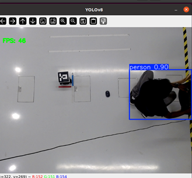

# COMP0182 (Multi-Agent Systems): Lab Sheet 7

----------------------------------------------------------------------------------------------------------------------------------------------------------------------------------------------------------------------------

## Task 1: Single-Robot Auto Navigation towards one destination marked by one ArUco Marker

Again, target is to finish running single-robot (real TurtleBot3) auto navigation towards one destination marked by one ArUco marker from previous lab session. 

All students should have camera calibrated and able to detect single ArUco marker. 

If not, please do it and make sure you are able to run the auto navigation script with one ArUco marker. One marker on the TurtleBot3, the other serves as the destination.

Once you finish this task, you will be able to move your robot autonomously to the destination ArUco marker.


## Task 2: Single-Robot Auto Navigation towards two destinations marked by two ArUco Markers

To be filled.

## Task 3 (Optional): Install and Run YOLOv8 Object Detection using USB Camera with ROS Noetic on Ubuntu 20.04

First, you connect the Logitech C920 HD Pro camera to **Remote PC** (or your laptop). 

This task provides how to install and run YOLOv8 object detection algorithm using USB camera based on PyTorch-YOLOv8. 

**Development Environment**:

Ubuntu 20.04

ROS Noetic

Python>=3.7.0

PyTorch>=1.7

**Prerequisites**:

```bash
pip install ultralytics

pip install rospkg
```

**Installation YOLOv8 on ROS**:

```bash
cd /your/catkin_ws/src

git clone https://github.com/narsimlukemsaram/yolov8_ros.git

cd ..

catkin_make
```

**Run YOLOv8 on ROS**:

Launch yolo_v8.launch file, all you should have to do is change the image topic you would like to subscribe to:

```bash
roslaunch yolov8_ros yolo_v8.launch
```

Output like this:



==============================================================================

## Troubleshoot / Suggestions

==============================================================================

**Step 1. Setup and make Ubuntu 20.04 identify the camera**.

First plug the camera to USB port.

Open a terminal, list all cameras plugged in and detected by system:

```bash
ls /dev/video*
```

Plug and unplug the Logitech C920 HD Pro camera and identify the correct /dev/video*.

In my case camera was mounted on path **/dev/video2**.

**Step 2. Open the usb_cam_stream_publisher.launch file and change your identified camera.**

Go to the folder and open the usb_cam_stream_publisher.launch file: <catkin_ws>/src/COMP0182-Multi-Agent-Systems/turtlebot3_burger_auto_navigation/auto_aruco_marker_finder/launch/usb_cam_stream_publisher.launch. 

Example of how your node might look after changing video and changing the auto focus control:

```bash
<!--
Example of run:
roslaunch usb_cam_stream_publisher.launch video_device:=/dev/video2 image_width:=640 image_height:=480
-->

<launch>
<arg name="video_device" default="/dev/video2" /> <!-- video2 for Logitech C920 HD Pro Camera  -->
<arg name="image_width" default="640" />
<arg name="image_height" default="480" />


<node name="usb_cam" pkg="usb_cam" type="usb_cam_node" output="screen" >
	<param name="video_device" value="$(arg video_device)" />
	<param name="image_width" value="$(arg image_width)" />
	<param name="image_height" value="$(arg image_height)"/>
	<param name="pixel_format" value="mjpeg" />
	<param name="camera_frame_id" value="usb_cam" />
	<param name="io_method" value="mmap"/>
  <param name="focus_auto" value="0" />  <!-- Disable autofocus -->
</node>
</launch>
```

**References:**

[1] Setup webcamera with ROS on Ubuntu 20.04, https://medium.com/@sigmoid90/ros-tips-setup-camera-with-ros-on-ubuntu-20-04-0069aea0341f/.

## To-Do List

- [Task 1] Single-Robot Auto Navigation towards one destination marked by one ArUco Marker
- [Task 2] Single-Robot Auto Navigation towards two destinations marked by two ArUco Markers
- [Task 3][Optional]. Install and Run YOLOv8 Object Detection using USB Camera with ROS Noetic on Ubuntu 20.04
